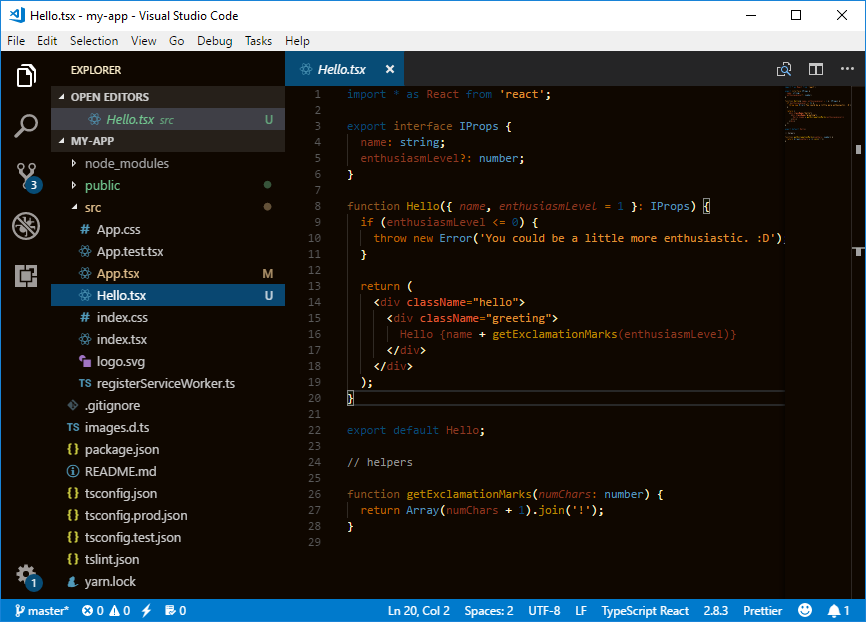

# Dark Autumn Frost Theme

VSCode dark theme with autumn colors and a little bit of frost (inspired by the [Coffee Dark Roast theme][cdrt]).
You can help by reporting issues [here](https://github.com/fimius23/dark-autumn-frost/issues)

## Screenshot



## Getting started

The easiest way to install is for free from the [Visual Studio Code Marketplace](https://marketplace.visualstudio.com/items/fimius.dark-autumn-frost)

### Activate theme

Launch _Quick Open_,

-  <a href="https://code.visualstudio.com/shortcuts/keyboard-shortcuts-linux.pdf">Linux</a> `Ctrl + Shift + P`
-  <a href="https://code.visualstudio.com/shortcuts/keyboard-shortcuts-macos.pdf">macOS</a> `⌘ + Shift + P`
-  <a href="https://code.visualstudio.com/shortcuts/keyboard-shortcuts-windows.pdf">Windows</a> `Ctrl + Shift + P`

Type `theme` and choose `Preferences: Color Theme`, then select `Dark Autumn Frost`.

### Other Ways to Install

#### From Quick Open

Launch _Quick Open_

-  <a href="https://code.visualstudio.com/shortcuts/keyboard-shortcuts-linux.pdf">Linux</a> `Ctrl+P`
-  <a href="https://code.visualstudio.com/shortcuts/keyboard-shortcuts-macos.pdf">macOS</a> `⌘P`
-  <a href="https://code.visualstudio.com/shortcuts/keyboard-shortcuts-windows.pdf">Windows</a> `Ctrl+P`

Paste the following command and press `Enter`:

```shell
ext install dark-autumn-frost
```

#### Packaged VSIX Extension

[Download the latest .vsix release](https://marketplace.visualstudio.com/_apis/public/gallery/publishers/fimius/vsextensions/dark-autumn-frost/latest/vspackage) file from the marketplace and install it from the command line

```shell
code --install-extension dark-autumn-frost-*.*.*.vsix
```

or from within VS Code by launching _Quick Open_ and running the _Install from VSIX..._ command.

#### GitHub Repository Clone

Change to your `.vscode/extensions` [VS Code extensions directory](https://code.visualstudio.com/docs/extensions/install-extension#_side-loading).
Depending on your platform it is located in the following folders:

-  **Linux** `~/.vscode/extensions`
-  **macOs** `~/.vscode/extensions`
-  **Windows** `%USERPROFILE%\.vscode\extensions`

Clone the `Dark Autumn Frost Theme` repository as `fimius.dark-autumn-frost`:

```shell
git clone https://github.com/fimius23/dark-autumn-frost.git fimius.dark-autumn-frost
```

## Notes For Development

The project is structured to have all the colors defined in `src/settings.js` and the Theme file `themes/theme.json` to be built using the command `gulp build`.
Any editing of scopes should happen in `src/theme.json`.

### Prerequisites

- [node/npm][npm]
- gulp

### Commands

- `gulp build` builds the source file into the `themes/` directory
- `gulp clean` removes the source file and `themes/` directory
- `npm run prepublish` will prepare the source files and put them into the compiled `themes/` directory, to be consumed by `NPM`

### Tagging

### Preparing the Tag

This project uses [standard-version][standard-version] to prepare CHANGELOG.md and tag the project.

Run the command:

```shell
npm run release
```

Then verify that your `CHANGELOG.md` and your package.json look correct. As long as your git commit messages are
[conventional and accurate][conventionalcommits], you no longer need to specify the [semver][semver] type - and you get CHANGELOG generation for free!

### Commiting Your Changes

Run the command:

```shell
git push --follow-tags origin master
```

[cdrt]: https://github.com/gerane/VSCodeThemes/tree/master/gerane.Theme-Coffee_Dark_Roast
[npm]: https://www.npmjs.com/
[standard-version]: https://github.com/conventional-changelog/standard-version
[conventionalcommits]: https://conventionalcommits.org/
[semver]: http://semver.org/
